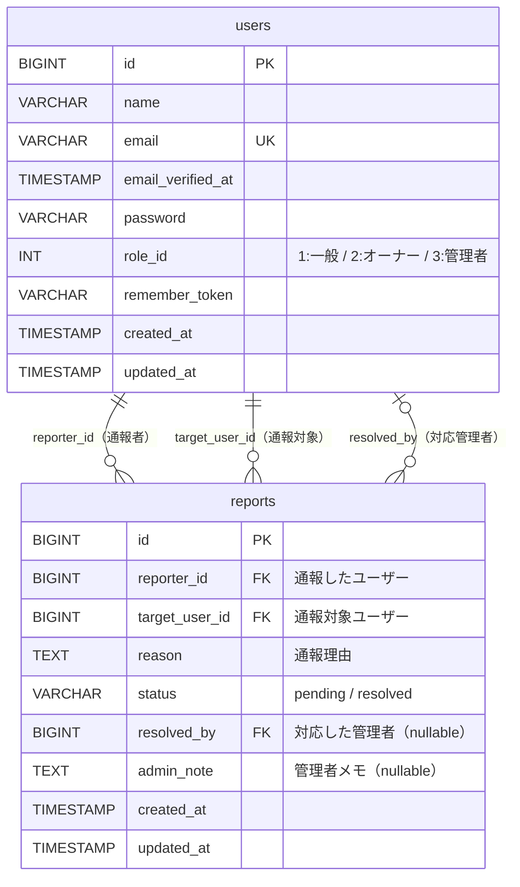
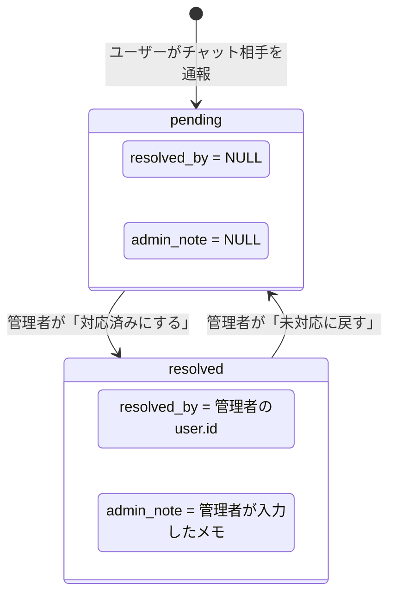

# 通報機能 ER図

## テーブル関連図

## 通報のライフサイクル

## テーブル定義

### users（ユーザー）

| カラム名            | 型                | 制約                     | 説明                           |
|---------------------|-------------------|--------------------------|--------------------------------|
| id                  | BIGINT UNSIGNED   | PK, AUTO_INCREMENT       | ユーザーID                     |
| name                | VARCHAR(255)      | NOT NULL                 | ユーザー名                     |
| email               | VARCHAR(255)      | NOT NULL, UNIQUE         | メールアドレス                 |
| email_verified_at   | TIMESTAMP         | NULLABLE                 | メール認証日時                 |
| password            | VARCHAR(255)      | NOT NULL                 | パスワード（ハッシュ）         |
| role_id             | INT               | NOT NULL, DEFAULT 1      | 権限 (1:一般, 2:オーナー, 3:管理者) |
| remember_token      | VARCHAR(100)      | NULLABLE                 | ログイン記憶トークン           |
| created_at          | TIMESTAMP         | NULLABLE                 | 作成日時                       |
| updated_at          | TIMESTAMP         | NULLABLE                 | 更新日時                       |

### reports（通報）

| カラム名         | 型                | 制約                                    | 説明                                            |
|------------------|-------------------|-----------------------------------------|-------------------------------------------------|
| id               | BIGINT UNSIGNED   | PK, AUTO_INCREMENT                      | 通報ID                                          |
| reporter_id      | BIGINT UNSIGNED   | FK → users.id, CASCADE DELETE           | 通報したユーザーのID                             |
| target_user_id   | BIGINT UNSIGNED   | FK → users.id, CASCADE DELETE           | 通報対象のユーザーID                             |
| reason           | TEXT              | NOT NULL                                | 通報理由                                        |
| status           | VARCHAR(20)       | NOT NULL, DEFAULT `'pending'`           | 対応状態 (`pending`:未対応 / `resolved`:対応済み) |
| resolved_by      | BIGINT UNSIGNED   | FK → users.id, NULLABLE, NULL ON DELETE | 対応した管理者のID                               |
| admin_note       | TEXT              | NULLABLE                                | 管理者の対応メモ                                |
| created_at       | TIMESTAMP         | NULLABLE                                | 作成日時                                        |
| updated_at       | TIMESTAMP         | NULLABLE                                | 更新日時                                        |

**インデックス:**
- `(status)` — ステータスでの絞り込み用

## リレーション一覧

| 起点テーブル | リレーション種別 | 先テーブル | 外部キー        | 説明                       |
|-------------|----------------|-----------|-----------------|----------------------------|
| reports     | BelongsTo      | users     | reporter_id     | 通報者                     |
| reports     | BelongsTo      | users     | target_user_id  | 通報対象ユーザー           |
| reports     | BelongsTo      | users     | resolved_by     | 対応した管理者（nullable） |
